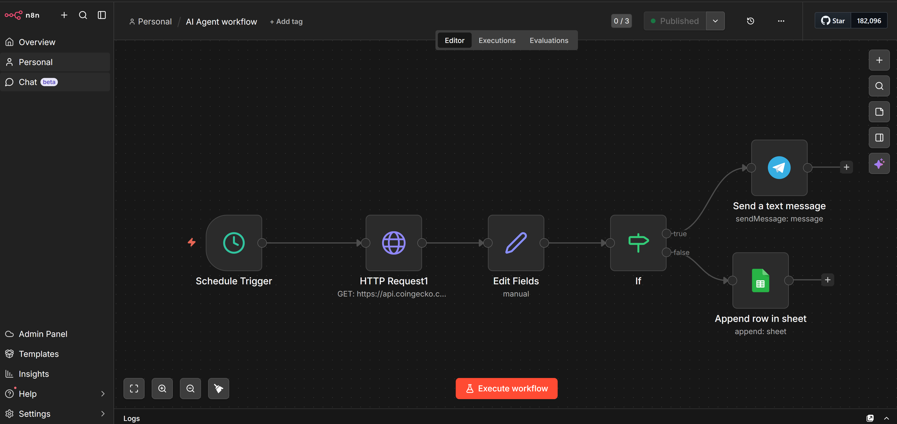

🤖 AI Agent Workflow (n8n)

📌 Description

This project is an automation workflow built with n8n.
It retrieves data from an external API, processes it, and performs automated actions like sending alerts and storing data.

⚙️ Tech Stack

* n8n (workflow automation)
* HTTP API (CoinGecko or similar)
* Telegram Bot
* Google Sheets

🔄 Workflow Overview

* Schedule Trigger → runs automatically
* HTTP Request → fetches data from API
* Edit Fields → processes the data
* IF Node → checks conditions
* Actions:

  * Send Telegram alert
  * Save data to Google Sheets

📸 Workflow Screenshot

🛠️ Setup

1. Import `workflow.json` into n8n
2. Configure your API credentials
3. Set up Telegram bot
4. Connect Google Sheets
5. Activate the workflow

## 👨‍💻 Author

Ziad El Yazidi
